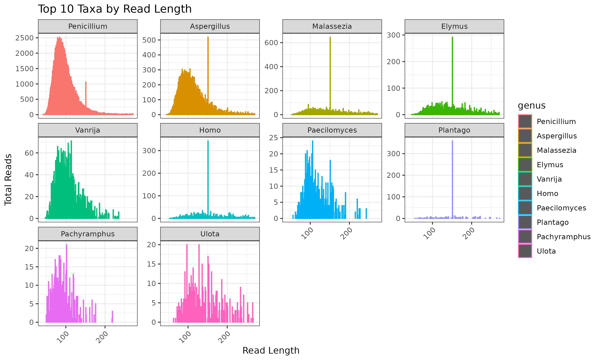
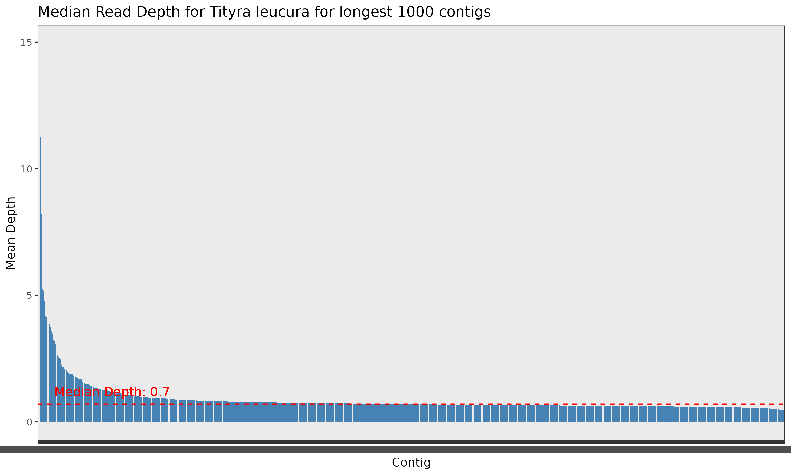
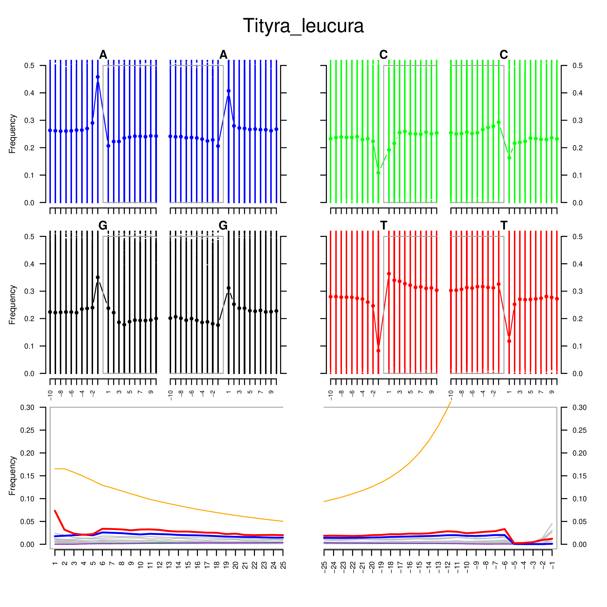

# *Tityra leucura* Sequencing Data Analysis Pipeline

This pipeline provides an end-to-end workflow for analysing the hDNA properties of the *Tityra leucura* sequencing data, from raw data to taxonomic classification and DNA damage analysis. Below is a summary of each step and guidance on interpreting the results.

## Running the Pipeline

The complete pipeline is implemented in: `shell/main.sh`

To run the entire pipeline:

```bash
bash Tityra/shell/main.sh
```

## Pipeline Steps

1. **Copy Raw Data**
   - Raw sequencing files are copied from the central data repository to the project directory for processing.

2. **Read Trimming (fastp)**
   - Reads are quality- and adapter-trimmed using `fastp`.
   - Outputs: trimmed paired-end reads, merged reads, and quality reports (HTML/JSON).
   - Interpretation: High-quality, adapter-free reads are essential for accurate downstream analysis. Review the HTML report for quality metrics and adapter content.

   

3. **ECMSD Pipeline**
   - The ECMSD pipeline is run on the trimmed and merged reads and maps reads against a mitochondrial reference database to identify the identity of mitochondiral reads and the corresponding read length to distinguish endogenous DNA and potential contaminant eukaryotic DNA. This pipeline is still under development and may change in the future.
   - Outputs: summary statistics.
   - Interpretation: The below figure shows that the majority of mitochondrial reads are not endogenous but rather of Penicilium origin, indicating contamination. The read length distribution shows that the majority of reads are short, which is typical for hDNA samples. only the ninth-most abundant taxon *Pachyramphus* is closely related to *Tityra leucura* and may thus represent traces of endogenous DNA. The read length distribution shows that the majority of reads are short, which is typical for hDNA samples. Conversely, the read length distirbution of human DNA is much longer, indicating that this contamination happend during the DNA extraction or sequencing process rather than during sample collection.
   -



1. **Kraken2 Taxonomic Classification**
   - Both paired and merged reads are classified using Kraken2 against a comprehensive database.
   - Outputs: Classification reports for paired and merged reads, and a summary CSV.
   - Interpretation: The summary CSV provides an overview of the taxonomic composition of the sample. We find that only 23% of the reads were classified in the Kraken database. Out of those app. 8% were classified as human, which is likely due to contamination during the DNA extraction or sequencing process and consistent with the previous result. Only a small fraction of the remaining reads were classified as bacterial.

   

2. **Sequencing Depth Analysis**
   - After reads are aligned to the reference genome of the closest available relative [*Pachyramphus minor*](https://www.ncbi.nlm.nih.gov/Taxonomy/Browser/wwwtax.cgi?mode=Info&id=369605), sequencing coverage is calculated across all contigs to assess the read depth and breadth of coverage.
   - Outputs: Coverage statistics table and depth visualization plot.
   - Interpretation: The coverage plot shows the mean sequencing depth for the 1000 longest contigs, ranked by umber of covered bases. The red dashed line indicates the median depth across these contigs. This analysis shows that most of the contigs have low but relatively uniform coverage.
   

   See also the coverage statistics table [`results/minimap2/Tityra_leucura.coverage.txt`](results/minimap2/Tityra_leucura.coverage.txt`) for detailed coverage metrics per contig.

3. **mapDamage Analysis**
   - After mapping using minimap2 and samtools (see above), we analyze the alignment with mapDamage to assess DNA damage patterns.
   - Outputs: BAM files, mapDamage plots (PDF/PNG).
   - Interpretation: mapDamage plots visualize nucleotide misincorporation and fragmentation patterns typical of historical or degraded DNA. The excess of G and A (purine bases) one basepair upstream of the read indicates depurination and the elevated frequency of C->T misincorporation at the 5' end of the read indicates deamination, both typical for historical DNA. This suggests that the mapped reads are indeed historical and has undergone typical DNA damage processes.

   

## Final Notes

- In summary, the analysis indicates that endogenous DNA from *Tityra leucura* is present, but the majority of reads are likely contaminated with DNA from other sources, particularly from the genus *Penicillium*. The read length distribution and DNA damage patterns are consistent with historical DNA. The read deppth analysis shows that the sequencing depth is relatively low but uniform across the contigs, which is typical for hDNA samples.
- All intermediate and final results are organized in the `results/` directory by analysis type.
- Review quality and summary reports at each step to ensure data integrity and successful processing.
- For troubleshooting or further analysis, refer to the log files and HTML/JSON reports generated by each tool.

---

*Pipeline maintained by [Your Name]. For questions or issues, please contact the maintainer.*
