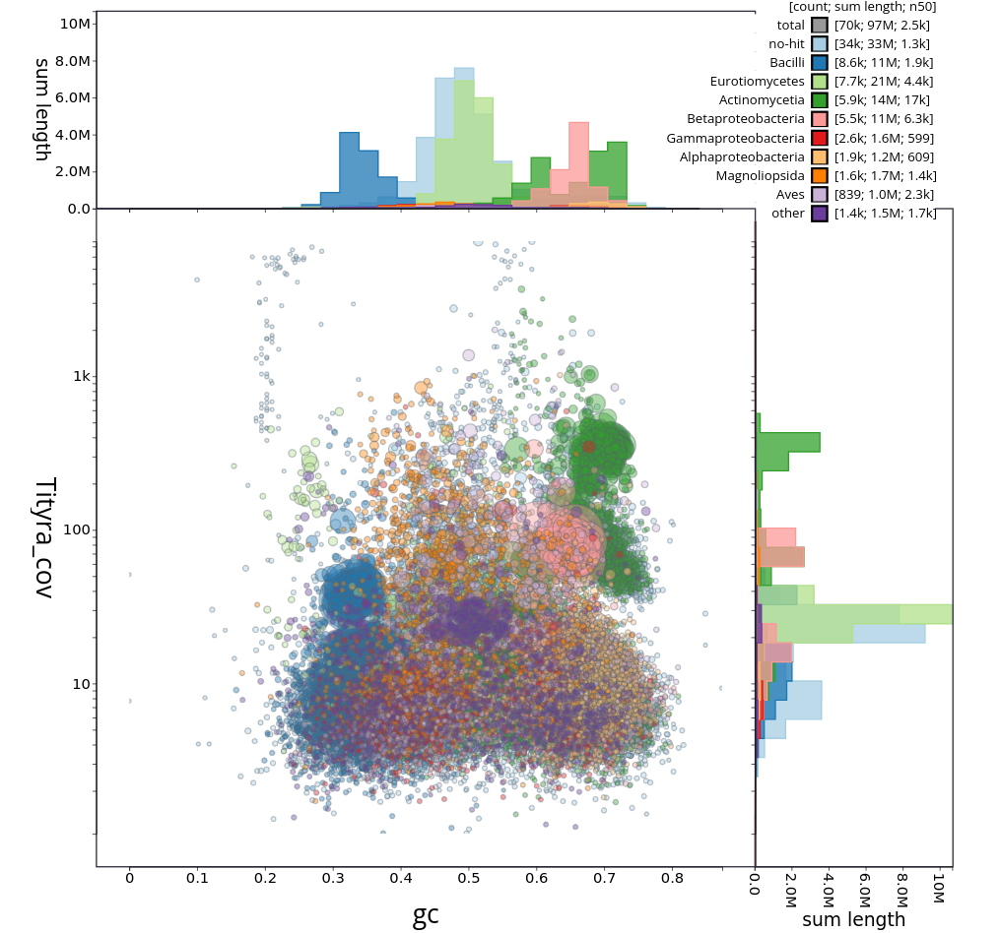
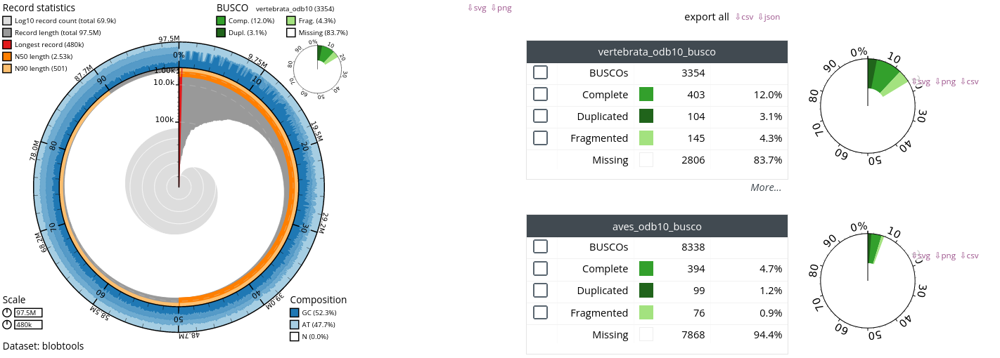

# *Tityra leucura* Sequencing Data Analysis Pipeline

This pipeline provides an end-to-end workflow for analysing the hDNA properties of the *Tityra leucura* sequencing data, from raw data to taxonomic classification and DNA damage analysis. In addition the pipeinle now produces a mitogenome of *Tityra* from the consenus of mapped reads aagins the *Pachyrhampus minor* mitogenome. Furthermore, after removal of contaminant reads, de-novo assembly with Spades followed by BUSCO analyses results in hundreds of BUSCO gene sequences. Below is a summary of each step and guidance on interpreting the results.

## Running the Pipeline

The complete pipeline is implemented in: `shell/main.sh`

To run the entire pipeline:

```bash
bash Tityra_hDNA_analysis/shell/main.sh
```

## Pipeline Steps

1. **Copy Raw Data**
   - Raw sequencing files are copied from the central data repository to the project directory for processing.

2. **Read Trimming (fastp)**
   - Reads are quality- and adapter-trimmed using `fastp`.
   - Outputs: trimmed paired-end reads, merged reads, and quality reports (HTML/JSON).
   - Interpretation: High-quality, adapter-free reads are essential for accurate downstream analysis. Review the HTML report for quality metrics and adapter content.

   

3. **ECMSD Pipeline**
   - The ECMSD pipeline is run on the trimmed and merged reads and maps reads against a mitochondrial reference database to identify the identity of mitochondiral reads and the corresponding read length to distinguish endogenous DNA and potential contaminant eukaryotic DNA. This pipeline is still under development and may change in the future.
   - Outputs: summary statistics.
   - Interpretation: The below figure shows that the majority of mitochondrial reads are not endogenous but rather of Penicilium origin, indicating contamination. The read length distribution shows that the majority of reads are short, which is typical for hDNA samples. only the ninth-most abundant taxon *Pachyramphus* is closely related to *Tityra leucura* and may thus represent traces of endogenous DNA. Conversely, the read length distirbution of human DNA is much longer, indicating that this contamination happend during the DNA extraction or sequencing process rather than during sample collection.
   -


1. **Kraken2 Taxonomic Classification**
   - Both paired and merged reads are classified using Kraken2 against a comprehensive database.
   - Outputs: Classification reports for paired and merged reads, and a summary CSV.
   - Interpretation: The summary CSV provides an overview of the taxonomic composition of the sample focusing on plants, prokaryotes or human contaminants. We find that only 23% of the reads were classified in the Kraken database. Out of those app. 8% were classified as human, which is likely due to contamination during the DNA extraction or sequencing process and consistent with the previous result. Only a small fraction of the remaining reads were classified as bacterial.

   

2. **Sequencing Depth Analysis**
   - After reads are aligned to the reference genome of the closest available relative [*Pachyramphus minor*](https://www.ncbi.nlm.nih.gov/Taxonomy/Browser/wwwtax.cgi?mode=Info&id=369605), sequencing coverage is calculated across all contigs to assess the read depth and breadth of coverage.
   - Outputs: Coverage statistics table and depth visualization plot.
   - Interpretation: The coverage plot shows the mean sequencing depth for the 1000 longest contigs, ranked by number of covered bases. The red dashed line indicates the median depth across these contigs. This analysis shows that most of the contigs have low but relatively uniform meadian read depths of app. 0.7x.
   

   See also the coverage statistics table [`results/minimap2/Tityra_leucura.coverage.txt`](results/minimap2/Tityra_leucura.coverage.txt`) for detailed coverage metrics per contig.

3. **mapDamage Analysis**
   - After mapping using minimap2 and samtools (see above), we analyze the alignment with mapDamage to assess DNA damage patterns.
   - Outputs: BAM files, mapDamage plots (PDF/PNG).
   - Interpretation: mapDamage plots visualize nucleotide misincorporation and fragmentation patterns typical of historical or degraded DNA. The excess of G and A (purine bases) one basepair upstream of the read indicates depurination and the elevated frequency of C->T misincorporation at the 5' end of the read indicates deamination, both typical for historical DNA. This suggests that the mapped reads are indeed historical and has undergone typical DNA damage processes.

   

4. **Mitochondrial Genome Assembly**
   - Downloads the closest available mitochondrial reference genome (*Pachyramphus minor*) and maps reads to it for mitochondrial genome reconstruction.
   - Outputs: BLAST results, mitochondrial BAM files, coverage statistics, and consensus sequence.
   - Interpretation: This analysis specifically targets mitochondrial DNA recovery. The coverage statistics show how well the mitochondrial genome is represented in the sample. The consensus sequence represents the reconstructed mitochondrial genome for *Tityra leucura*. It can be found in the file [`results/mitogenome/Tityra_leucura_mito_consensus.fasta.gz`](results/mitogenome/Tityra_leucura_mito_consensus.fasta.gz). The mitochondrial genome is reconstructed from the reads that map to the *Pachyramphus minor* reference genome, which is closely related to *Tityra leucura*. The coverage statistics indicate the sequencing depth and uniformity across the mitochondrial genome, which is essential for assessing the quality of the assembly.

   

5. **Contaminant Removal**
   - Maps reads to known contaminant reference genomes (including human, fungal species like *Penicillium*, *Vanrija*, *Malassezia*, and *Aspergillus*) and retains only unmapped reads for downstream analysis.
   - Outputs: Cleaned reads free from major contaminants.
   - Interpretation: This step removes reads that map to known contaminant genomes identified in previous steps. The resulting unmapped reads are more likely to represent endogenous *Tityra leucura* DNA and are used for de novo genome assembly.

   Contaminant references used:
   - *Vanrija pseudolonga*
   - *Penicillium coprophilum*  
   - *Homo sapiens*
   - *Malassezia restricta*
   - *Aspergillus cristatus*

6. **De Novo Genome Assembly (AutDeNovo)**
   - Performs de novo genome assembly using our in-house AutDeNovo pipeline on contaminant-free reads. see the shell scripts in the folder [`results/denovo/shell`](results/denovo/shell)
   - Outputs: Assembled contigs, assembly statistics, BUSCO completeness assessment, and taxonomic classification of assembled sequences.
   - Interpretation: This final step attempts to reconstruct the *Tityra leucura* genome from the cleaned reads. The Blobplots  below show that there is still ample contamination in the assembled 48k contigs (of length >=500b) with a total yield of 97Mbp length. The full assembly can be found [here](results/denovo/output/Tityra_ILL.fa.gz).
  
  

  However, note that hundreds of BUSCO genes from the vertrebrate and the aves databases were recovered, which can be found in the folders [`results/denovo/results/denovo/output/busco_sequences`](results/denovo/results/denovo/output/busco_sequences) and [`results/denovo/results/denovo/output/busco_sequences`](results/denovo/results/denovo/output/busco_sequences) (see below). While these need to be carefully evaluated given the high levels of contamination, they may still provide useful for phylogenetic analyses.


  
   Assembly results: `results/denovo/`

## Final Notes

- In summary, the analysis indicates that endogenous DNA from *Tityra leucura* is present, but the majority of reads are initially contaminated with DNA from other sources, particularly from the genus *Penicillium*. The pipeline includes comprehensive contaminant removal and attempts de novo genome assembly of the cleaned endogenous reads. The read length distribution and DNA damage patterns are consistent with historical DNA. The read depth analysis shows that the sequencing depth is relatively low but uniform across the contigs, which is typical for hDNA samples. The consesus mitochondrial genome of *Tityra leucura* was successfully reconstructed from the mapped reads against the *Pachyramphus minor* reference genome, and together with the BUSCO genes from the de novo assembly, may provide a solid foundation for further phylogenetic analyses.
- All intermediate and final results are organized in the `results/` directory by analysis type.
- Review quality and summary reports at each step to ensure data integrity and successful processing.
- For troubleshooting or further analysis, refer to the log files and HTML/JSON reports generated by each tool.

---
