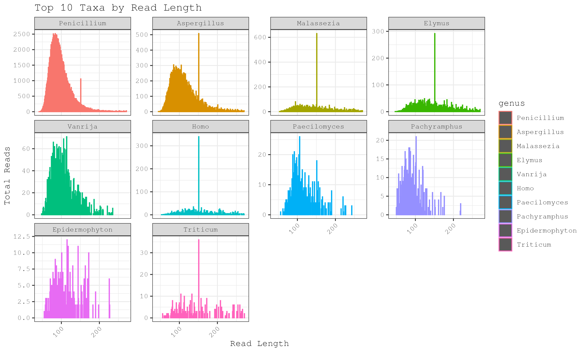
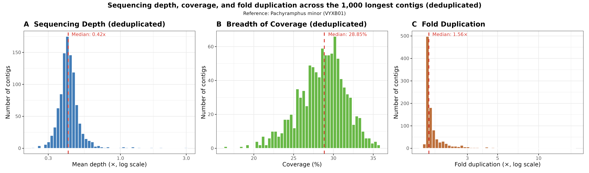
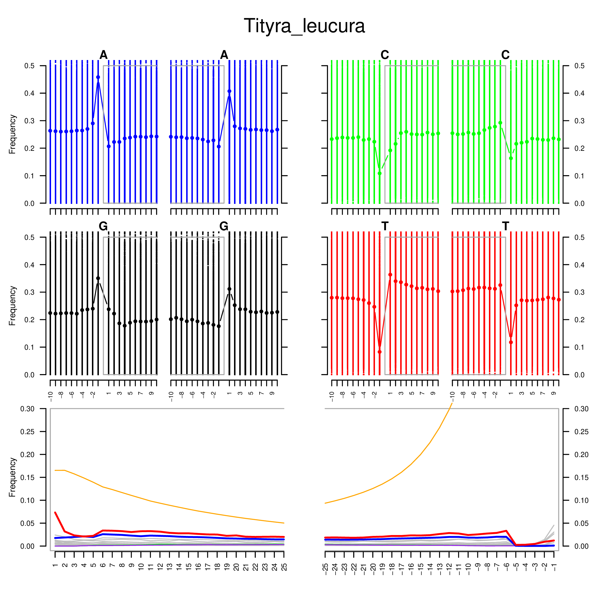
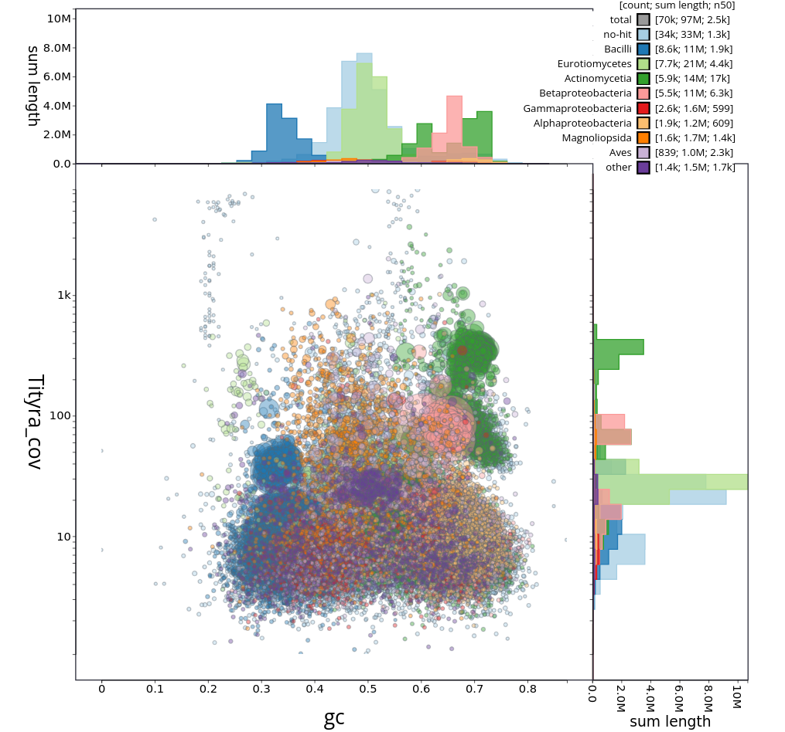
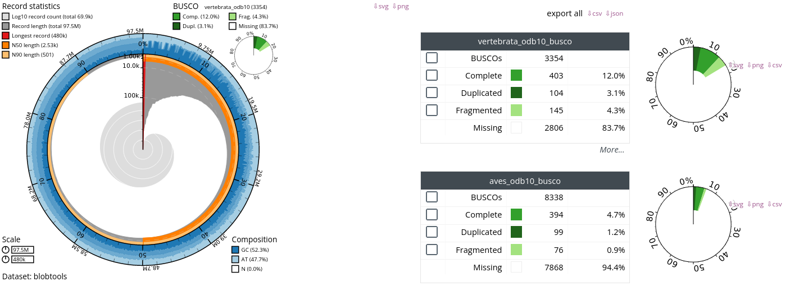
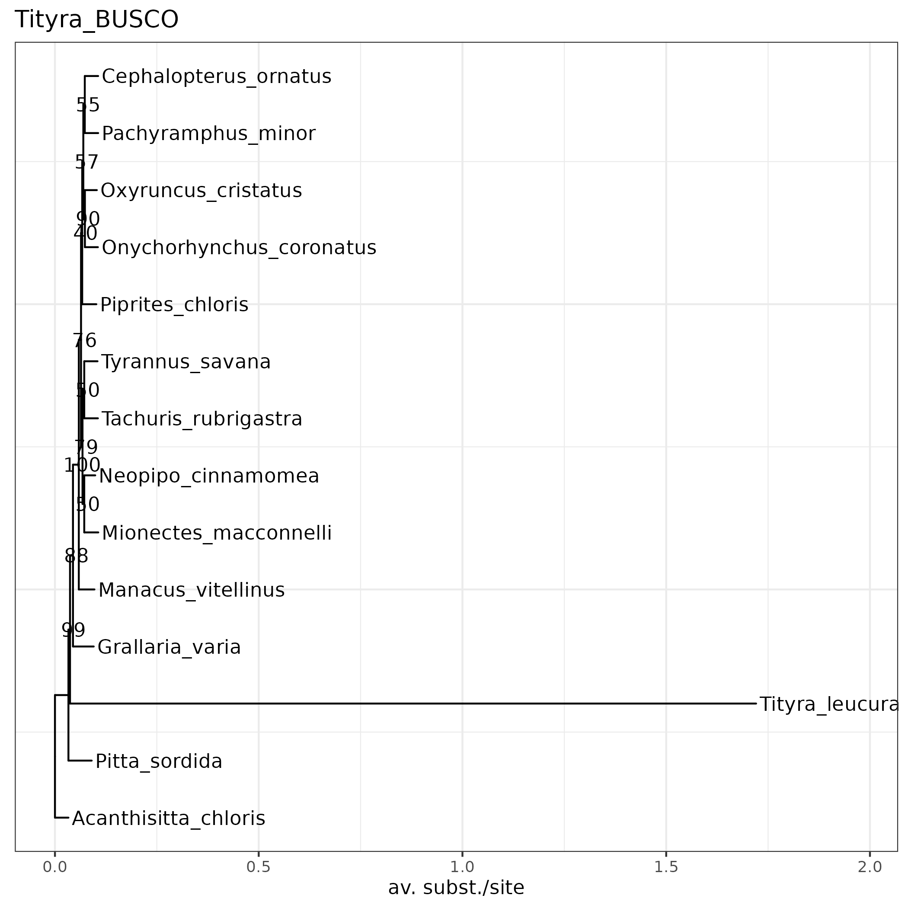
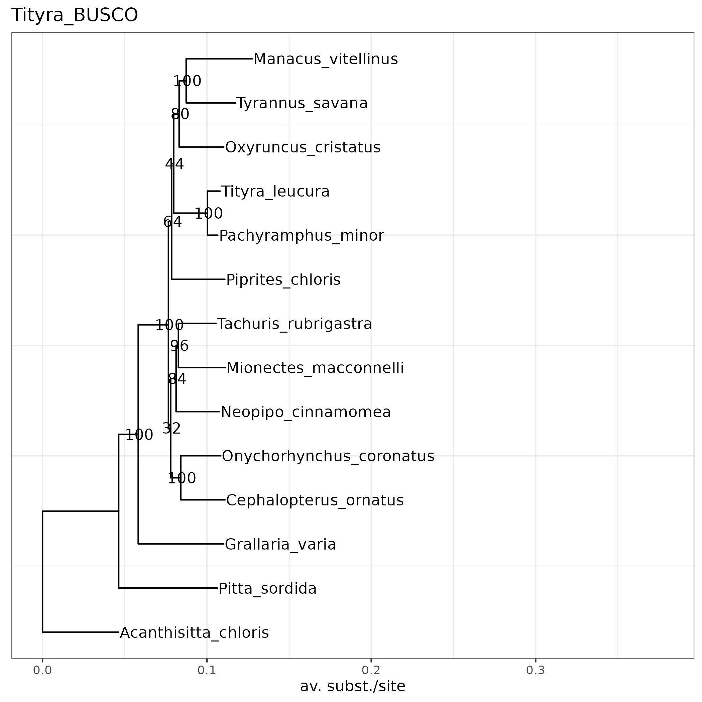
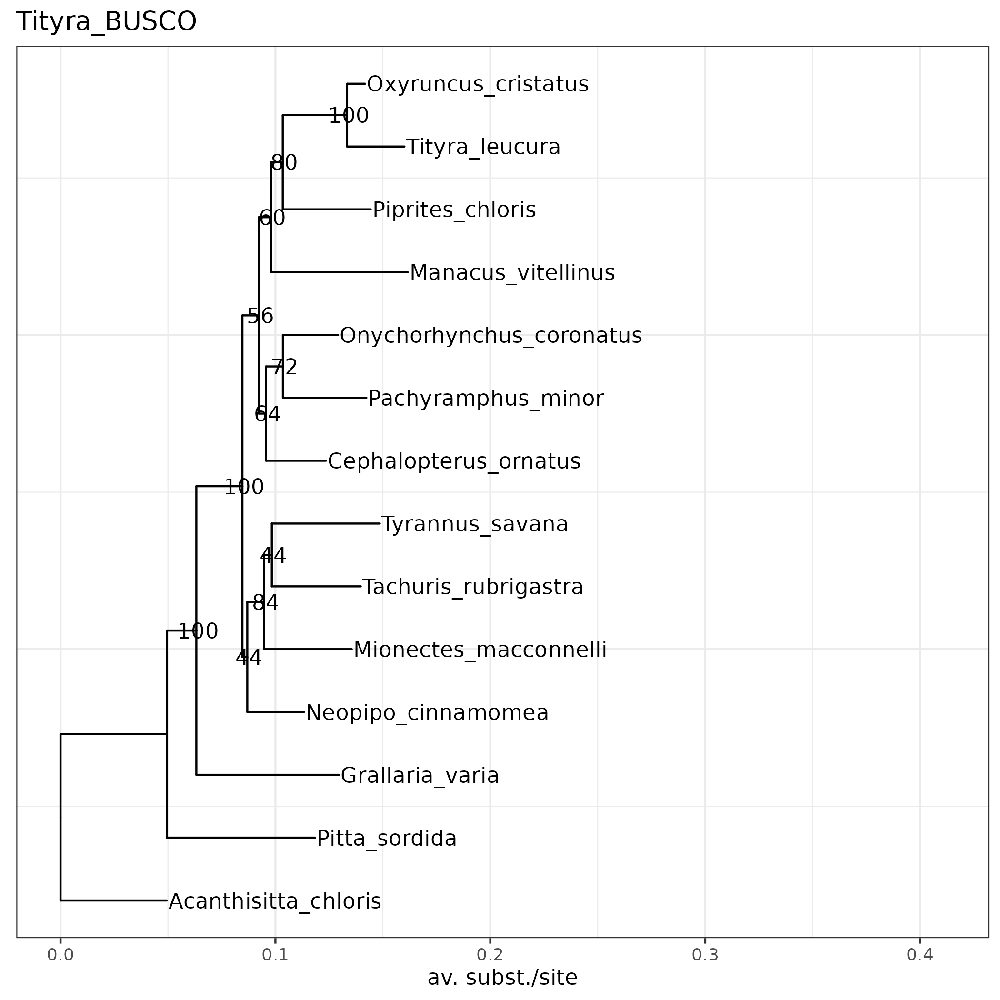
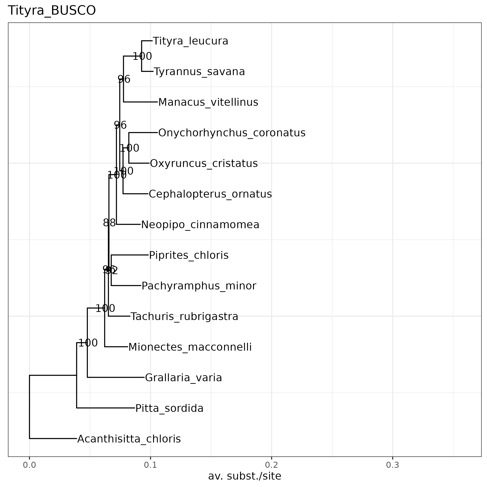

# *Tityra leucura* Sequencing Data Analysis Pipeline

This pipeline provides an end-to-end workflow for analysing the hDNA properties of the *Tityra leucura* sequencing data, from raw data to taxonomic classification and DNA damage analysis. In addition the pipeline now produces a mitogenome of *Tityra* from the consensus of mapped reads against the *Pachyramphus minor* mitogenome. Furthermore, after removal of contaminant reads, de-novo assembly with Spades followed by BUSCO analyses results in hundreds of BUSCO gene sequences. Below is a summary of each step and guidance on interpreting the results.

## Running the Pipeline

The complete pipeline is implemented in: `shell/main.sh`

To run the entire pipeline:

```bash
bash Tityra_hDNA_analysis/shell/main.sh
```

## Pipeline Steps

### 1. **Copy Raw Data**

   Raw sequencing files are copied from the central data repository to the project directory for processing.

### 2. **Read Trimming (fastp)**

   **Process:** Reads are quality- and adapter-trimmed using `fastp`.

   **Outputs:** Trimmed paired-end reads, merged reads, and quality reports (HTML/JSON).

   **Interpretation:** High-quality, adapter-free reads are essential for accurate downstream analysis. Review the HTML report for quality metrics and adapter content.

   

### 3. **ECMSD Pipeline**

   **Process:** The ECMSD pipeline is run on the trimmed and merged reads and maps reads against a mitochondrial reference database to identify the identity of mitochondiral reads and the corresponding read length to distinguish endogenous DNA and potential contaminant eukaryotic DNA. This pipeline is still under development and may change in the future.

   **Outputs:** Summary statistics.

   **Interpretation:** The below figure shows that the majority of mitochondrial reads are not endogenous but rather of *Penicillium* origin, indicating contamination. The read length distribution shows that the majority of reads are short, which is typical for hDNA samples. Only the ninth-most abundant taxon *Pachyramphus* is closely related to *Tityra leucura* and may thus represent traces of endogenous DNA. Conversely, the read length distribution of human DNA is much longer, indicating that this contamination happened during the DNA extraction or sequencing process rather than during sample collection.



### 4. **Kraken2 Taxonomic Classification**

   **Process:** Both paired and merged reads are classified using Kraken2 against a comprehensive database.

   **Outputs:** Classification reports for paired and merged reads, and a summary CSV.

   **Interpretation:** The summary CSV provides an overview of the taxonomic composition of the sample focusing on plants, prokaryotes or human contaminants. We find that only 23% of the reads were classified in the Kraken database. Out of those app. 8% were classified as human, which is likely due to contamination during the DNA extraction or sequencing process and consistent with the previous result. Only a small fraction of the remaining reads were classified as bacterial.

   

### 5. **Sequencing Depth Analysis**

   **Process:** After mapping reads against the reference genome of the closest available relative [*Pachyramphus minor*](https://www.ncbi.nlm.nih.gov/Taxonomy/Browser/wwwtax.cgi?mode=Info&id=369605), sequencing depth and coverage is calculated across all contigs to assess the read depth and breadth of coverage.

   **Outputs:** Coverage statistics table and depth visualization plot.

   **Interpretation:** The coverage plot shows the mean sequencing depth for the 1000 longest contigs, ranked by number of covered bases. The red dashed line indicates the median depth across these contigs. This analysis shows that most of the contigs have low but relatively uniform median read depths of app. 0.7x.

   

   See also the coverage statistics table [`results/minimap2/Tityra_leucura.coverage.txt`](results/minimap2/Tityra_leucura.coverage.txt`) for detailed coverage metrics per contig.

6. **mapDamage Analysis**

   **Process:** After mapping using minimap2 and samtools (see above), we analyze the alignment with mapDamage to assess DNA damage patterns.

   **Outputs:** BAM files, mapDamage plots (PDF/PNG).

   **Interpretation:** mapDamage plots visualize nucleotide misincorporation and fragmentation patterns typical of historical or degraded DNA. The excess of G and A (purine bases) one basepair upstream of the read indicates depurination and the elevated frequency of C->T misincorporation at the 5' end of the read indicates deamination, both typical for historical DNA. This suggests that the mapped reads are indeed historical and has undergone typical DNA damage processes.

   

### 7. **Mitochondrial Genome Assembly**

   **Process:** After downloading the closest available mitochondrial reference genome (*Pachyramphus minor*) reads are mapped to this reference for mitochondrial genome reconstruction by generating a consensus sequence across all mapped reads using `samtools`.

   **Outputs:** BLAST results, mitochondrial BAM files, coverage statistics, and consensus sequence.

   **Interpretation:** This analysis specifically targets mitochondrial DNA recovery. The consensus sequence representing the reconstructed mitochondrial genome for *Tityra leucura* can be found at [`results/mitogenome/Tityra_leucura_mito_consensus.fasta.gz`](results/mitogenome/Tityra_leucura_mito_consensus.fasta.gz). This mitochondrial genome is reconstructed from the reads that map to the *Pachyramphus minor* reference genome, which is closely related to *Tityra leucura*. The coverage statistics, which can be found [here](results/mitogenome/Tityra_leucura_mito.coverage.txt) indicate the sequencing depth is on average 28-fold but that only 38% of the mitochondrial reference is covered.

### 8. **Contaminant Removal**

   **Process:** To further reduce the amount of exogenous contaminant DNA, reads are mapped to known contaminant reference genomes (including human, fungal species like *Penicillium*, *Vanrija*, *Malassezia*, and *Aspergillus*). Only unmapped (merged) reads are retained for downstream analysis.

   **Outputs:** Cleaned merged reads free from major contaminants.

   **Interpretation:** This step removes reads that map to known contaminant genomes identified in previous steps. The resulting unmapped reads are more likely to represent endogenous *Tityra leucura* DNA and are used for de novo genome assembly described below.

   **Contaminant references used:**

- *Vanrija pseudolonga*
- *Penicillium coprophilum*  
- *Homo sapiens*
- *Malassezia restricta*
- *Aspergillus cristatus*

### 9. **De Novo Genome Assembly (AutDeNovo)**

   **Process:** This analysis step performs de novo genome assembly using our in-house AutDeNovo pipeline (see here: <https://github.com/nhmvienna/AutDeNovo>) on contaminant-free merged reads. see the shell scripts in the folder [`results/denovo/shell`](results/denovo/shell)

   **Outputs:** Assembled contigs, assembly statistics, BUSCO completeness assessment, and taxonomic classification of assembled sequences.

   **Interpretation:** This final step attempts to reconstruct the *Tityra leucura* genome from the cleaned reads. The Blobplots generated by blobtools below show that there is still ample contamination in the assembled 48k contigs (of length >=500b) with a total yield of 97Mbp length. The full assembly can be found [here](results/denovo/output/Tityra_ILL.fa.gz).
  
  

  However, note that hundreds of BUSCO genes from the vertebrate and the aves databases were recovered as complete or fragmented copies, which can be found in the folders [`results/denovo/output/busco_sequences`](results/denovo/output/busco_sequences). While these need to be carefully evaluated given the high levels of contamination, they may still provide useful data for phylogenetic analyses.


  
   **Assembly results:** `results/denovo/`

### 10. **Phylogenetic Analysis with BUSCO Genes**

   **Overview:** This comprehensive phylogenetic analysis uses BUSCO genes identified from the de novo assembly and reference genomes to construct evolutionary relationships using multiple complementary approaches.

   **Outputs:** Multiple sequence alignments, phylogenetic trees, and bootstrap support values.

   **Methodology:** The analysis employs several methodological approaches:

#### Approach 1: De novo assembly-based phylogeny

- BUSCO v5.4.3 is run on 14 avian genomes using the aves_odb10 database to identify single-copy orthologs
- Complete BUSCO genes present in all 14 genomes are identified and filtered
- Protein sequences are extracted, concatenated by gene, and aligned using MAFFT v7.487 with `--auto` algorithm selection
- Sequence IDs are standardized post-alignment using custom Python scripts
- Individual gene alignments are concatenated into a supermatrix using `proteins2genome.py`

   **RAxML Parameters (v2.8.10):**

- Model: PROTGAMMAWAG (protein evolution with gamma-distributed rate heterogeneity and WAG substitution matrix)
- 20 ML search replicates (-N 20)
- Automatic bootstrap stopping criterion (autoMRE)
- Outgroup: *Acanthisitta chloris*
- 200 CPU threads
- Bootstrap support values are mapped onto the best ML tree
- Tree visualization using R with ggtree, ape, and phytools packages

#### Approach 2: Reference-based consensus sequence phylogeny

- *Tityra leucura* reads are mapped to BUSCO gene sets from three reference species (*Pachyramphus minor*, *Ochrospiza cristatus*, *Tachyphonus surinamus*) using minimap2
- Only genes with ≥2-fold average coverage and ≥60% breadth of coverage are retained
- Consensus sequences are generated using samtools consensus calling
- Phylogenetic reconstruction follows the same RAxML protocol as above

#### Key Outputs

- Complete BUSCO gene list: [`results/phylogeny/concatenated/final_busco_ids.txt`](results/phylogeny/concatenated/final_busco_ids.txt)
- Individual gene alignments: `results/phylogeny/mafft/`
- Concatenated alignment: [`results/phylogeny/phylogeny/alignment.fa`](results/phylogeny/phylogeny/alignment.fa)
- Final phylogenetic tree: [`results/phylogeny/phylogeny/RAxML_bipartitions.FINAL`](results/phylogeny/phylogeny/RAxML_bipartitions.FINAL)
- Tree visualization: [`results/phylogeny/phylogeny/Tityra_BUSCO.png`](results/phylogeny/phylogeny/Tityra_BUSCO.png)
  
   **Results Interpretation:**

   The resulting tree based on concatenating all BUSCO genes does not place *Tityra leucura* correctly as a sister group to *Pachyramphus minor* but rather next to the outgroup and is characterized by very long branches. This is likely due to the high levels of contamination in the de novo assembly and the resulting BUSCO genes and makes this analysis very unreliable.

   

   **Alternative Strategy:**

   We therefore employed an alternative strategy by mapping the *Tityra leucura* reads to the BUSCO gene sets of *Pachyramphus minor*, *Ochrospiza cristatus* and *Tachyphonus surinamus* and generating consensus sequences for each BUSCO gene, whenever the minimum read depth was 2-fold and the coverage >60%. We then used the consensus sequences to reconstruct phylogenies based on concatenated gene sequences.
  
   

   **Comparative Results:**

   While the tree based on reads mapped to the *Pachyramphus minor* BUSCO gene set correctly places *Tityra leucura* as sister group to *Pachyramphus minor*, the trees based on the other two BUSCO gene sets do not but rather next to the reference. This indicates a strong reference bias in the BUSCO gene sets of *Ochrospiza cristatus* and *Tachyphonus surinamus* and further renders the phylogenetic analysis based on the BUSCO genes from the de novo assembly unreliable.
  
   **Results for *Ochrospiza cristatus*:**
   

   **Results for *Tachyphonus surinamus*:**
   

   **Additional Analyses:**

- Mapping reads to *Pachyramphus minor* BUSCO genes
- Mapping reads to other reference BUSCO gene sets (*Ochrospiza cristatus*, *Tachyphonus surinamus*)
- Individual gene phylogenies for detailed evolutionary analysis

## Final Notes

- In summary, the analysis indicates that endogenous DNA from *Tityra leucura* is present, but the majority of reads are initially contaminated with DNA from other sources, particularly from the genus *Penicillium*. The pipeline includes comprehensive contaminant removal and attempts de novo genome assembly of the cleaned endogenous reads. The read length distribution and DNA damage patterns are consistent with historical DNA. The read depth analysis shows that the sequencing depth is relatively low but uniform across the contigs, which is typical for hDNA samples.

- The consensus mitochondrial genome of *Tityra leucura* was successfully reconstructed from reads mapped against the *Pachyramphus minor* reference genome, achieving 28-fold average coverage over 38% of the reference genome.

- **Phylogenetic Analysis Limitations**: The phylogenetic analysis reveals significant challenges due to contamination. The tree based on BUSCO genes from the de novo assembly places *Tityra leucura* incorrectly next to the outgroup with very long branches, indicating unreliable results due to high contamination levels. Only the analysis using *Pachyramphus minor* BUSCO genes correctly places *Tityra leucura* as a sister group to *Pachyramphus minor*. The analyses using *Ochrospiza cristatus* and *Tachyphonus surinamus* BUSCO gene sets show strong reference bias, placing *Tityra leucura* next to the reference species rather than in the correct phylogenetic position.

- **Conclusions**: While this study demonstrates the potential for recovering genomic data from historical *Tityra leucura* specimens, the high levels of contamination significantly limit the reliability of phylogenetic inferences. The mitochondrial genome reconstruction and the reference-bias-free analysis using *Pachyramphus minor* BUSCO genes provide the most reliable molecular data, confirming the close relationship between these two species. Future work should focus on improved decontamination methods and targeted enrichment approaches to increase the proportion of endogenous DNA.

- All intermediate and final results are organized in the `results/` directory by analysis type.
- Review quality and summary reports at each step to ensure data integrity and successful processing.
- For troubleshooting or further analysis, refer to the log files and HTML/JSON reports generated by each tool.

---
